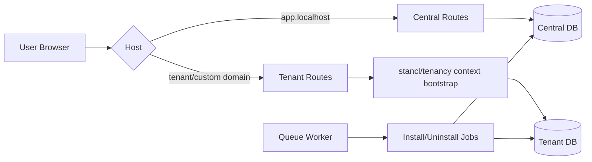
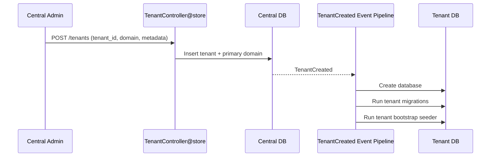
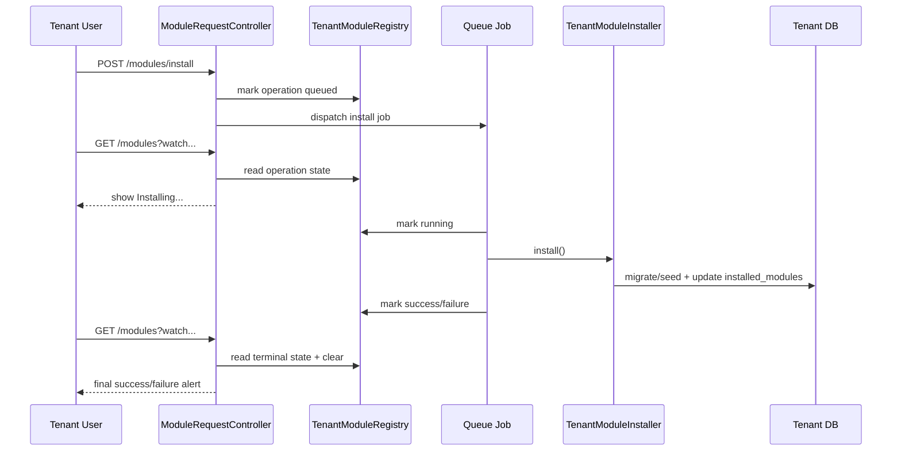

# Architecture Overview

## Topology

## Data ownership

- Central DB (`central`)
  - `tenants`, `domains`
  - `modules`, `module_requests`
  - central `users` (super admin / central auth)
- Tenant DB (`tenant{tenant_id}`)
  - tenant `users`
  - RBAC tables: `roles`, `features`, `permissions`, `role_permissions`
  - tenant business/module tables (for installed modules)

## Central tenant onboarding flow

## Module install/uninstall flow (hardened)

## Custom domain acceptance model

- Tenant can add custom domain.
- Verification requires TXT record match (`verification_code`).
- `verified_at` is set only after DNS verification passes.
- Internal domain-check endpoint only returns `OK` for:
  - central domains
  - verified custom domains

This allows edge proxy (Caddy) to gate host acceptance.
